<div align="center">


# 漢字仮名

**Type Japanese kanji, instantly see the hiragana and romaji.**

A fully offline Flutter app for Android that lines up kanji, kana and romaji word by word
— like a translator's side-by-side view. Type a single kanji and it also looks up its
on'yomi and kun'yomi.

[](https://flutter.dev)
[](https://dart.dev)
[](#installation)
[](https://github.com/Aclguh/kanji-hiragana/releases/latest)
[](LICENSE)

[简体中文](README.md) · **English**

</div>

---

## Features

- **Kanji → hiragana → romaji** in a three-column, word-by-word table, powered by
  morphological analysis (kuromoji + IPADIC)
- **Single-kanji detail**: type one kanji and get its **on'yomi** and **kun'yomi**
  together with romaji, stroke count, school grade and meanings
- **Two switchable views**
  - **Table**: three columns side by side (kanji / hiragana / romaji) with part-of-speech tags
  - **Furigana**: textbook-style ruby, reading above the kanji and romaji below
- **Two-track readings**: standard spelling for annotation, plus the actual pronunciation
  - 東京 is annotated `とうきょう` with a pronunciation note of `とーきょー`
  - The particle は is annotated `は` with a note that it reads `わ`
    (highlighted in vermilion — exactly the grammar point worth learning)
- **Kanji filter**: strokes and frequency both accept an arbitrary range
  (lower ~ upper, leave blank for no bound), plus reading composition and school grade.
  Sortable, with a full-screen grid you can tap into for details
- **Interface language**: switch between 简体中文 and English (Settings → Language).
  Every UI string *and* the kanji meanings follow the switch. The four characters
  漢字仮名 stay in traditional form as the app's mark
- **Settings**: theme (light / dark / follow system), auto-rotate switch (off by default),
  about page
- Tap any word to copy it; one-tap copy of the full kana; romaji can be toggled
- **Focus-first main screen**: opens with a single centred input box, then animates
  into the full interface as you type
- **Fully offline**: the dictionary ships with the app — no network calls, no permissions,
  no ads

## Screenshots

<div align="center">

| Empty state | Table |
| :---: | :---: |
| 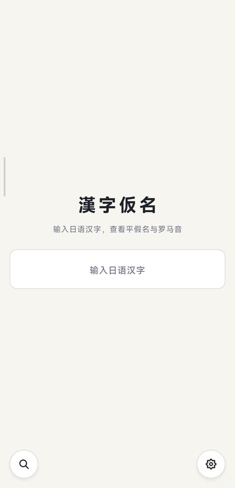 | 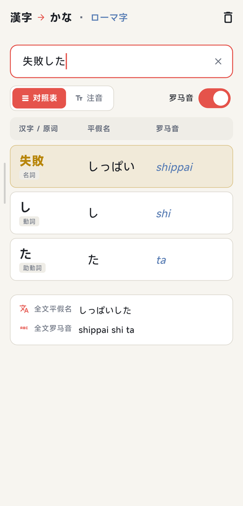 |
| Opens with just a centred input box | Word-by-word columns, the current word highlighted in vermilion |

| Furigana | Single kanji |
| :---: | :---: |
| 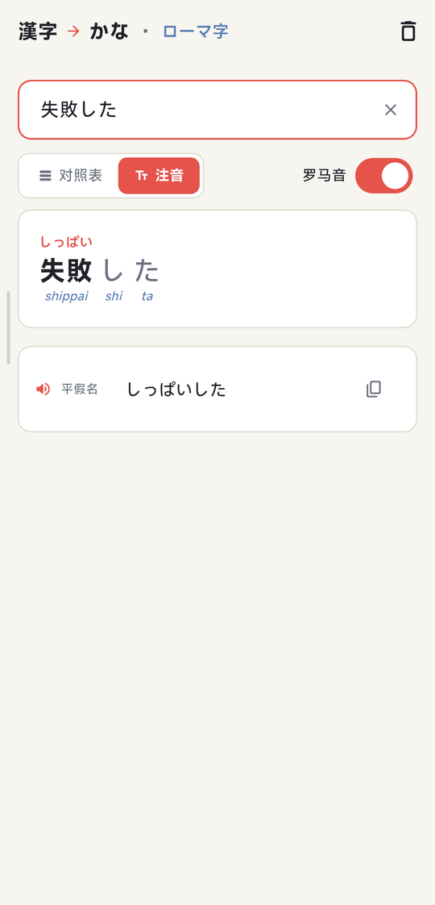 | 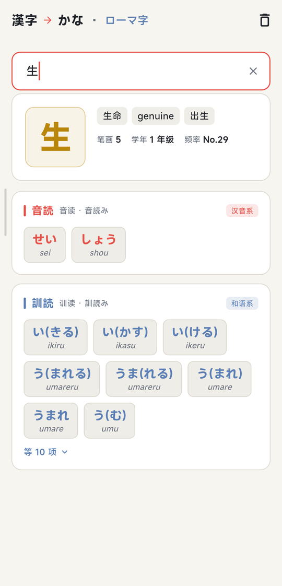 |
| Reading above the kanji, romaji below | On'yomi, kun'yomi, meanings, strokes and grade |

| Settings | Filter |
| :---: | :---: |
| 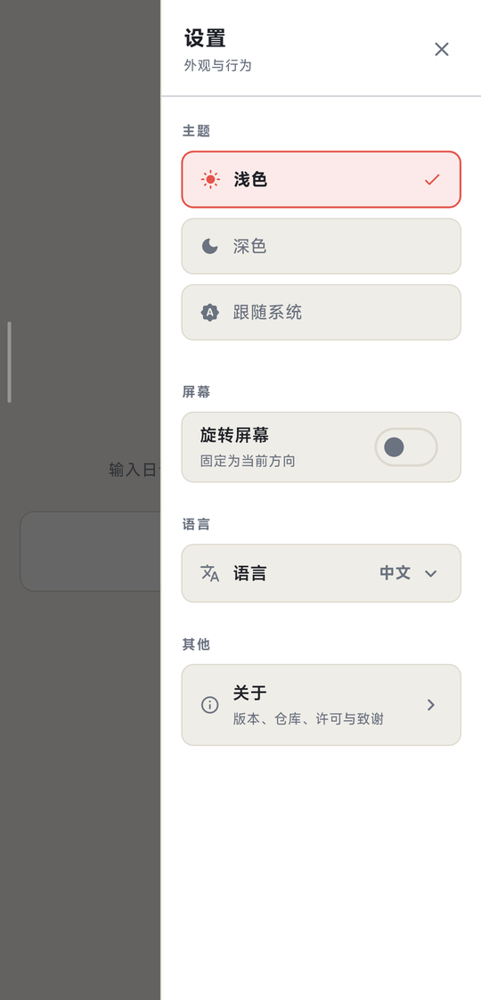 | 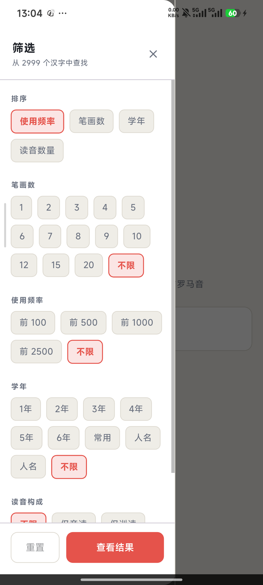 |
| The gear at the bottom right opens theme, interface language, rotation and about | The magnifier at the bottom left opens stroke and frequency ranges |

| Filter results | About |
| :---: | :---: |
| 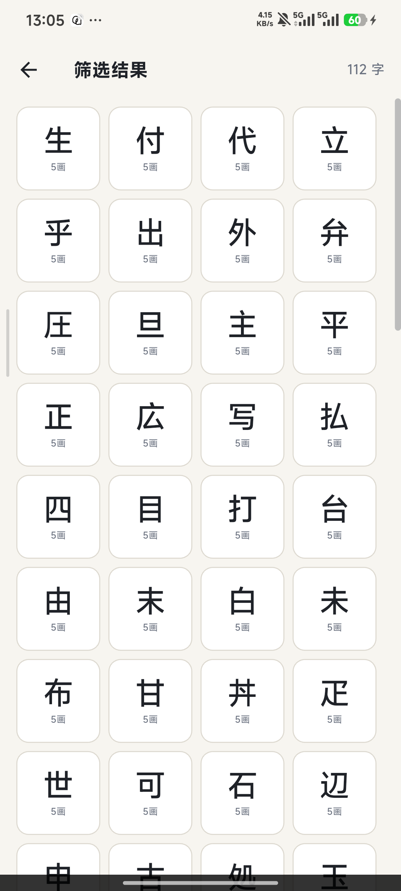 | 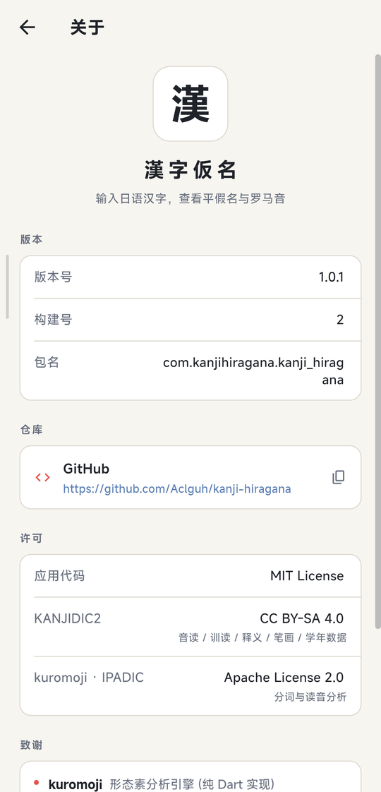 |
| A full-screen grid, with a side scrollbar when it overflows | Version, GitHub repository, open-source licenses and credits |

| Light theme | Dark theme |
| :---: | :---: |
| 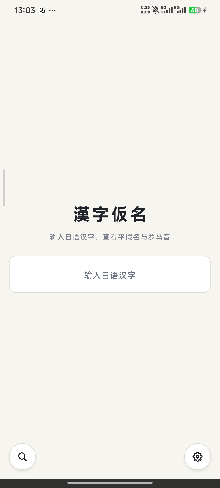 | 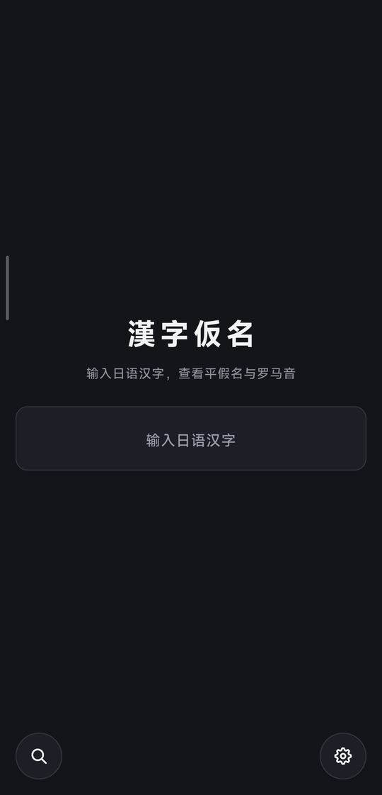 |
| Light: paper-white background with ink-dark text | Dark: the same screen recoloured, preferences persisted |

| Interface language | English interface |
| :---: | :---: |
| 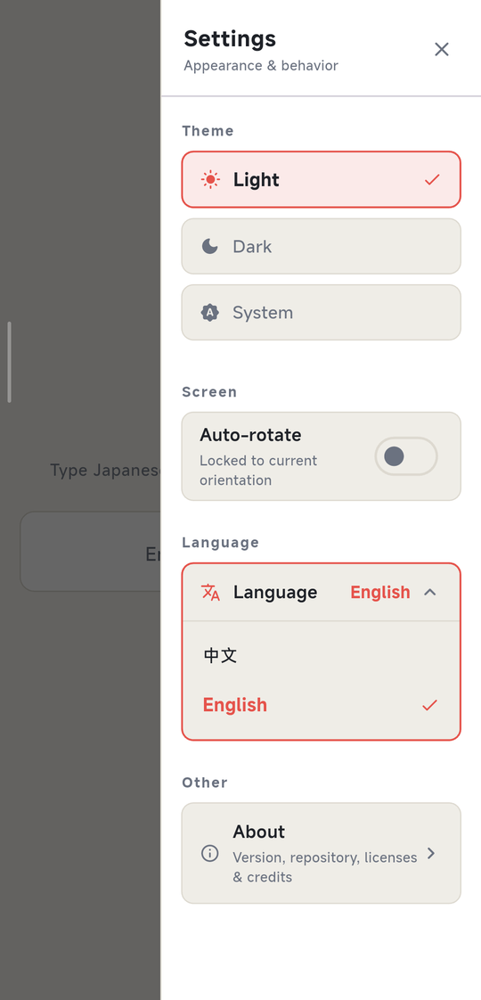 | 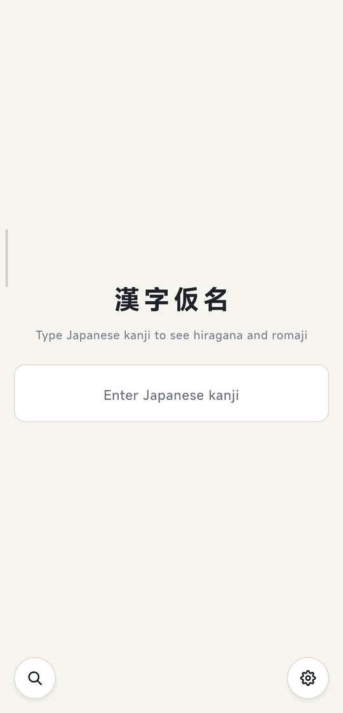 |
| Expand the language selector and pick one | Every string follows the language; 漢字仮名 stays in traditional form |

</div>

> The remaining screenshots above are taken with the Chinese interface, which is the default.

## Installation

### Install the APK directly

Download the APK for your architecture from
[Releases](https://github.com/Aclguh/kanji-hiragana/releases/latest):

| File | Devices | Size |
| --- | --- | --- |
| `app-arm64-v8a-release.apk` | Almost all modern phones (**recommended**) | 39.7 MB |
| `app-armeabi-v7a-release.apk` | Older 32-bit devices | 37.3 MB |
| `app-x86_64-release.apk` | Emulators / x86 tablets | 41.1 MB |

> If you are unsure, install `arm64-v8a`. The wrong architecture reports
> "App not installed".

### Build from source

```bash
git clone https://github.com/Aclguh/kanji-hiragana.git
cd kanji-hiragana
flutter pub get
flutter build apk --release --split-per-abi
# Output: build/app/outputs/flutter-apk/app-arm64-v8a-release.apk
```

> The repository does not contain a signing key. Without `android/key.properties`,
> release builds automatically fall back to the debug signature — installable and
> usable, but not suitable for distribution. To publish your own builds, put your key
> in `android/key.properties`; that file and `*.jks` are already excluded by
> `.gitignore`.

## Usage

1. Open the app and type Japanese into the centred input box (kanji, kana or a mixed
   sentence all work)
2. The interface expands as you type:
   - **Several characters** → the word-by-word table or furigana view
   - **A single kanji** → additionally its on'yomi, kun'yomi and meanings
3. Switch between **Table** and **Furigana** at the top
4. Tap a word to copy it, or use the top-right action to copy the full kana
5. The gear at the bottom right opens **Settings** (theme / auto-rotate / language /
   about); the magnifier at the bottom left opens **Filter** (find kanji by strokes,
   frequency and more)

## How it works

| Stage | Implementation |
| --- | --- |
| Tokenization and readings | [`kuromoji`](https://pub.dev/packages/kuromoji) (Atilika IPADIC, pure Dart) |
| On'yomi / kun'yomi | 2999 common kanji extracted from KANJIDIC2, see `lib/core/kanji_reading_dict.dart` |
| Katakana → hiragana | Code-point offset (`0x30A1 - 0x3041`) |
| Hiragana → romaji | Hand-written modified Hepburn romanisation |
| Settings persistence | [`shared_preferences`](https://pub.dev/packages/shared_preferences) |
| Icons | Hand-drawn vector paths via `CustomPainter` (gear / magnifier) — no icon font, no emoji |
| State and UI | Flutter Material 3, with light and dark Japanese-style themes |
| Localization | `AppStrings` sealed class with `ZhStrings` / `EnStrings`, injected through an `InheritedWidget` |

### Why two tracks for readings

kuromoji returns two different fields for the same word, with different purposes:

| Field | 東京 | は (particle) | Character |
| --- | --- | --- | --- |
| `reading` | トウキョウ | ハ | Standard kana spelling, good for annotation |
| `pronunciation` | トーキョー | ワ | Actual speech; long vowels written with `ー` |

**The app uses both.** Kana annotation and romaji come from `reading` so the spelling is
standard and matches a dictionary. The real pronunciation is listed underneath as
`pronunciation`, with particle shifts (は→わ, へ→え, を→お) highlighted in vermilion.

Using only `pronunciation` would produce spellings like 東京 → とーきょー that you cannot
look up. Using only `reading` would hide how the word is actually said. Two tracks is the
only way to lose no information.

### About on'yomi / kun'yomi

IPADIC returns only the single most common reading for a character and **does not
distinguish on'yomi from kun'yomi**, so that data is extracted separately from
[KANJIDIC2](https://www.edrdg.org/wiki/index.php/KANJIDIC_Project) (CC BY-SA 4.0),
covering 2999 kyōiku / jōyō / jinmeiyō kanji with their `ja_on` and `ja_kun` fields.

Kun'yomi notation:

| KANJIDIC2 | Shown in the app | Meaning |
| --- | --- | --- |
| `まな.ぶ` | `まな(ぶ)` | The dot marks the okurigana boundary |
| `-び` / `び-` | `(び)` | Affix only, never a standalone word |

Parentheses are stripped when deriving romaji (`まな(ぶ)` → `manabu`).

### Meanings in two languages

KANJIDIC2's meanings are English natively; the generator maps them to Chinese for the
Chinese interface and keeps the English originals in a separate `meaningsEn` field. The
English UI therefore shows KANJIDIC2's own wording rather than a back-translation.

## Project layout

```
lib/
  main.dart                  Entry point: loads settings, warms up the dictionary
  theme.dart                 Light / dark Japanese-style palettes (AppColors ThemeExtension)
  home_page.dart             Main page: focus-style input, view switch, floating buttons
  core/
    kana_romaji.dart         Kana ↔ romaji conversion (the core algorithm)
    morpheme.dart            Word and analysis-result models (two-track readings)
    japanese_analyzer.dart   Morphological analysis service (singleton, offline)
    kanji_reading_dict.dart  [GENERATED] on'yomi / kun'yomi for 2999 kanji
    kanji_filter.dart        Filter model and matching logic
    settings.dart            Persisted theme / auto-rotate / language
    strings.dart             zh + en UI strings (AppStrings sealed class + InheritedWidget)
  widgets/
    alignment_table.dart     Three-column table view
    furigana_view.dart       Furigana (ruby) view
    single_kanji_view.dart   Single-kanji on'yomi / kun'yomi detail
    sliding_drawer.dart      Side drawer shell (panel + scrim)
    settings_drawer.dart     Settings drawer content
    filter_drawer.dart       Filter drawer content
    filter_result_page.dart  Full-screen filter result grid
    about_page.dart          About page (version / repository / licenses / credits)
    vector_icon.dart         Hand-drawn vector icons (gear / magnifier)
test/
  core_test.dart             Unit tests
integration_test/
  ui_test.dart               On-device UI tests
tool/
  verify.dart                Standalone verification (86 assertions, runs with dart run)
  gen_kanji_dict.py          KANJIDIC2 → Dart data generator
  gen_icon.py                App icon generator
  data/                      KANJIDIC2 source data (.gz only, ~1.5 MB)
```

## Development

```bash
flutter pub get

# Static analysis
flutter analyze

# Logic verification (no flutter_test needed, runs anywhere, 86 assertions)
dart run tool/verify.dart

# Unit tests
flutter test

# On-device UI tests (requires a connected device)
flutter test integration_test/ui_test.dart -d <device-id>

# Run over USB
flutter run -d <device-id> --release
```

### Regenerating the data file

The dictionary is pre-generated Dart source; day-to-day development does not need this.
Only run it when updating the dictionary data:

```bash
# 1. Download KANJIDIC2 (~1.5 MB gzip)
curl -L -o tool/data/kanjidic2.xml.gz \
  https://www.edrdg.org/kanjidic/kanjidic2.xml.gz

# 2. Generate lib/core/kanji_reading_dict.dart
python tool/gen_kanji_dict.py
```

The script reads the `.gz` directly and picks out the kyōiku / jōyō / jinmeiyō kanji.
(The 16 MB decompressed XML is not kept in the repository; it is excluded by
`.gitignore`.)

The app icon is generated too — re-run this after changing the design:

```bash
python tool/gen_icon.py   # writes to android/app/src/main/res/
```

### About the size

kuromoji embeds the IPADIC dictionary as gzip-compressed Dart source (~23 MB of source),
which dominates the APK size. To slim it down, **always split by ABI**:

```bash
flutter build apk --release --split-per-abi
```

Each APK then contains a single architecture and is considerably smaller.

## Data sources and licenses

- **Application code**: [MIT](LICENSE)
- **On'yomi / kun'yomi / meanings**:
  [KANJIDIC2](https://www.edrdg.org/wiki/index.php/KANJIDIC_Project), copyright
  Electronic Dictionary Research and Development Group, released under
  [CC BY-SA 4.0](https://creativecommons.org/licenses/by-sa/4.0/).
  `lib/core/kanji_reading_dict.dart` is a derivative work and is likewise provided under
  CC BY-SA 4.0.
- **Tokenization and readings**: [kuromoji](https://pub.dev/packages/kuromoji) and
  [IPADIC](https://www.atilika.com), Apache License 2.0.

## Credits

- [kuromoji](https://github.com/takuyaa/kuromoji.js) — the pure-Dart port of the
  morphological analyzer
- [KANJIDIC2](https://www.edrdg.org/wiki/index.php/KANJIDIC_Project) — kanji readings and
  meanings
- [Atilika](https://www.atilika.com) — the IPADIC dictionary
