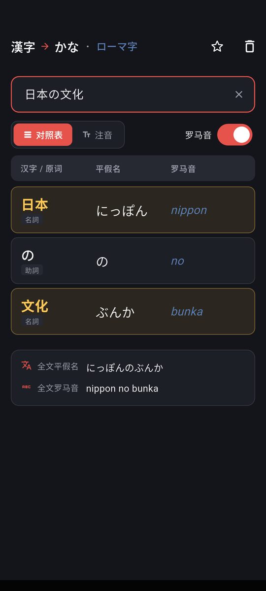

<div align="center">


# 漢字仮名

**输入日语汉字，即时看到对应的平假名与罗马音。**

一个完全离线的 Flutter 安卓应用，像翻译软件那样逐词对照汉字、假名与罗马音，
输入单个汉字时还能查它的音读与训读。

[](https://flutter.dev)
[](https://dart.dev)
[](#安装)
[](https://github.com/Aclguh/kanji-hiragana/releases/latest)
[](LICENSE)

**简体中文** · [English](README.en.md)

</div>

---

## 功能

- **汉字 → 平假名 → 罗马音** 逐词三列对照，基于形态素分析（kuromoji + IPADIC）
- **动词活用形提示**：识别动词与形容词活用形，注明词典原形（如「食べた」提示原形「食べる」）
- **长文本段落保持**：支持多行多段落输入，在对照表、振假名与纵书视图中清晰划分并保持排版
- **导出带注音文本与生词本**：支持一键导出为 HTML `<ruby>`、通用括号注音（如 `日本語(にほんご)`）或 **Anki 牌组格式**（TSV 制表符分隔，含词面、假名、罗马音、释义与笔画备注）
- **三种视图可切换**
  - **对照表**：逐词并排三列（汉字 / 平假名 / 罗马音），带**词性一级与细分类二级标签**与外来语源词徽标，底部摘要栏支持一键复制全文平假名与罗马音
  - **注音**：类似日语教材的振假名（Furigana），读音标在汉字上方
  - **纵书（縦書き）**：和风传统文库本竖排排版，右向左横向翻页滚动，长音符「ー」90度旋转，读音紧贴汉字右侧
- **纯离线原生发音（TTS）**：集成系统原生 TextToSpeech 语音引擎，支持逐词点按发音与整句连读，无网络权限且零第三方依赖
- **片假名外来语词源标注**：离线收录高频外来语词源原型与出处语言（如「コーヒー」标注荷文 koffie、「アルバイト」标注德文 Arbeit、「パン」标注葡文 pão），词条徽标直观展示
- **四字熟语（四字成语）反查**：常用四字熟语词典，单汉字详情页自动建立反向关联并展示含义与读音
- **康熙 214 部首检字表**：内嵌完整 214 部首表与笔画映射，按 1..17 画聚合分组，实时统计每个部首收录的汉字数量，点按直接筛选
- **Android 系统级划词查询（PROCESS_TEXT）**：在其他应用中选中日语文本，长按菜单直接选择「漢字仮名」快速查询
- **单汉字详解**：输入单个汉字时，列出该字的**音读**与**训读**，
  附康熙部首、罗马音、笔画数、学年、中文释义、**四字熟语搭配**、**同音汉字推荐**与**常见搭配词**（带词性标签）；常见词、熟语与同音字均支持点按跳转查询与长按复制
- **历史与收藏**：查过的内容自动留痕、一键收藏，空态首页点按即可回查，支持生词本一键导出为 Anki 牌组与纯文本
- **双轨读音**：标注用规范拼写，同时标出实际发音差异
  - 「東京」标注 `とうきょう`，发音注明 `とーきょー`
  - 助词「は」标注 `は`，注明读作 `わ`（朱红色突出，这正是要掌握的语法点）
- **多维度汉字筛选**：
  - 笔画数与使用频率支持任意区间输入（下限 ~ 上限，留空即不限）
  - **按读音反查**：输入平假名或片假名查对应汉字
  - **按含义查**：输入中文或英文释义关键词精确检索
  - **部首筛选**：快速筛选水、木、人等高频部首，亦可打开 214 部首检字表自由选择
  - 读音构成与学年条件，支持切换排序方式，全屏网格浏览结果并显示当前活跃条件摘要
- **界面语言**：简体中文 / English 一键切换（设置 → 语言），全部界面文案与汉字释义
  都会随之切换；「漢字仮名」四字作为应用标识保持繁体原样
- **设置**：主题切换（浅色 / 深色 / 跟随系统）、旋转屏幕开关（默认关闭）、关于页
- 点按任意词发音并复制，一键复制全文假名；罗马音可开关，空态支持剪贴板一键粘贴
- **聚焦式主界面**：打开时只有一个居中的输入框，输入后动画展开完整界面
- **完全离线**：词典随应用打包，无任何网络请求、无额外权限、无广告

## 截图

<div align="center">

| 空状态 | 对照表 |
| :---: | :---: |
|  |  |
| 打开时只有一个居中的输入框 | 逐词三列对照，朱红高亮当前词，附词性标签 |

| 浅色主题 | 深色主题 |
| :---: | :---: |
|  |  |
| 浅色主题：米白纸感底 + 墨色文字 | 深色主题：同一界面自动换色，设置持久保存 |

</div>

## 安装

### 直接安装 APK

从 [Releases](https://github.com/Aclguh/kanji-hiragana/releases/latest) 下载对应架构的 APK：

| 文件 | 适用设备 | 大小 |
| --- | --- | --- |
| `app-arm64-v8a-release.apk` | 绝大多数现代手机（**推荐**） | 40.4 MB |
| `app-armeabi-v7a-release.apk` | 较老的 32 位设备 | 38.5 MB |
| `app-x86_64-release.apk` | 模拟器 / x86 平板 | 41.8 MB |

> 若不确定选哪个，装 `arm64-v8a`；装错了会提示「应用未安装」。

### 从源码构建

```bash
git clone https://github.com/Aclguh/kanji-hiragana.git
cd kanji-hiragana
flutter pub get
flutter build apk --release --split-per-abi
# 产物: build/app/outputs/flutter-apk/app-arm64-v8a-release.apk
```

> 仓库不含签名密钥。未配置 `android/key.properties` 时，release 构建会自动
> 回落到 debug 签名（可正常安装使用，但不适合分发给他人）。
> 发布正式包时按官方文档在 `android/key.properties` 填入自己的密钥即可，
> 该文件与 `*.jks` 已被 `.gitignore` 排除。

## 使用

1. 打开应用，在居中的输入框里输入日语（汉字、假名、混合句子都行）
2. 输入内容后界面自动展开：
   - 输入**多个字** → 显示逐词对照表 / 注音视图
   - 输入**单个汉字** → 额外显示该字的音读、训读、释义与常见词汇等信息
3. 顶部可切换「对照表 / 注音」两种视图
4. 点按词条复制，或点右上角复制全文假名
5. 点标题栏星标**收藏**当前查询，收起键盘后空态首页出现「最近查询 / 收藏」
   词条，点按即可回查（长按删除单条，历史可一键清空）
6. 右下角齿轮按钮打开**设置**（主题 / 旋转屏幕 / 关于），
   左下角放大镜按钮打开**筛选**（按笔画、频率等条件查找汉字）

## 技术方案

| 环节 | 实现 |
| --- | --- |
| 分词与读音 | [`kuromoji`](https://pub.dev/packages/kuromoji)（Atilika IPADIC，纯 Dart 实现） |
| 音读 / 训读 | KANJIDIC2 离线提取的 2999 个常用汉字，见 `lib/core/kanji_reading_dict.dart` |
| 常见词汇 | 构建期从 kuromoji 内嵌 IPADIC 提取的搭配词（约 2 万条），见 `lib/core/kanji_words_dict.dart` |
| 康熙 214 部首 | 完整 214 部首字形与 1..17 笔画索引表，见 `lib/core/radical_dict.dart` |
| 片假名外来语 | 常见外来语原型与语种溯源词典，见 `lib/core/loanwords_dict.dart` |
| 四字熟语 | 精选四字熟语词典与汉字反向索引，见 `lib/core/yojijukugo_dict.dart` |
| 离线发音 (TTS) | Android 原生 `TextToSpeech` 引擎平台通道直调，见 `lib/core/tts_service.dart` |
| 跨应用查词 | Android `ACTION_PROCESS_TEXT` intent 平台通道直调，见 `lib/core/platform_service.dart` |
| 片假名 → 平假名 | 码位偏移转换（`0x30A1 - 0x3041`） |
| 平假名 → 罗马音 | 自实现改良式 Hepburn 拼写 |
| 设置与历史 | [`shared_preferences`](https://pub.dev/packages/shared_preferences) 本地持久化（主题 / 语言 / 视图状态 / 查询历史与收藏） |
| 图标 | `CustomPainter` 手绘矢量路径（齿轮 / 放大镜），不依赖字体或 emoji |
| 状态与 UI | Flutter Material 3，浅色 / 深色两套和风主题，支持对照表、注音与纵书视图 |

### 读音与发音的双轨策略

kuromoji 对同一个词给出两个不同的字段，用途不同：

| 字段 | 「東京」 | 「は」（助词） | 特性 |
| --- | --- | --- | --- |
| `reading`（读音） | トウキョウ | ハ | 规范假名拼写，适合标注 |
| `pronunciation`（发音） | トーキョー | ワ | 实际口语，长音用 `ー` 速记 |

**两个字段都用**：假名标注与罗马音取自 `reading`，保证拼写规范、学习者能查字典对上；
同时在词条下方另列 `pronunciation` 展示真实发音，并把助词音变
（は→わ、へ→え、を→お）用朱红突出。

如果只取 `pronunciation`，就会出现「東京 → とーきょー」这种查不到字典的拼写；
如果只取 `reading`，又会漏掉实际怎么读。双轨是唯一不丢信息的做法。

### 关于音读 / 训读

IPADIC 只给单个汉字一个最常用读音，**不区分音读与训读**，
因此这部分数据另行从 [KANJIDIC2](https://www.edrdg.org/wiki/index.php/KANJIDIC_Project)
提取（CC BY-SA 4.0），覆盖 2999 个教育 / 常用 / 人名用汉字，
含 `ja_on`（音读）与 `ja_kun`（训读）字段。

训读记法约定：

| KANJIDIC2 原记法 | 本应用显示 | 含义 |
| --- | --- | --- |
| `まな.ぶ` | `まな(ぶ)` | 点号是送假名分界 |
| `-び` / `び-` | `(び)` | 仅作词缀，不单独成词 |

界面显示罗马音时会自动剥除括号（`まな(ぶ)` → `manabu`）。

## 目录结构

```
lib/
  main.dart                  应用入口，启动时读取设置与查询记录并后台预热词典
  theme.dart                 浅色 / 深色两套和风配色（AppColors ThemeExtension）
  home_page.dart             主页面：聚焦式输入框 + 视图切换 + 历史收藏词条 + 悬浮按钮
  core/
    kana_romaji.dart         假名 ↔ 罗马音转换（核心算法）
    morpheme.dart            词模型与解析结果模型（双轨读音与 Anki 导出）
    japanese_analyzer.dart   形态素分析服务（单例，离线）
    kanji_reading_dict.dart  [自动生成] 2999 汉字的音读 / 训读
    kanji_words_dict.dart    [自动生成] 汉字的常见搭配词（IPADIC 提取）
    radical_dict.dart        康熙 214 部首与笔画映射表
    loanwords_dict.dart      片假名外来语词源原型与出处字典
    yojijukugo_dict.dart     常用四字熟语字典与单字反向索引
    tts_service.dart         离线原生 TTS 语音播放服务
    platform_service.dart    Android 跨应用划词系统通道服务
    kanji_filter.dart        汉字筛选条件模型与匹配逻辑
    query_store.dart         查询历史与收藏的持久化控制
    settings.dart            主题模式 / 旋转开关 / 语言 / 视图状态的持久化控制
    strings.dart             中英双语界面文案（AppStrings 密封类 + InheritedWidget）
  widgets/
    alignment_table.dart     三列对照表视图
    furigana_view.dart       振假名注音视图
    vertical_view.dart       和风传统竖排纵书视图（RTL 横向推进）
    single_kanji_view.dart   单汉字音读 / 训读 + 四字熟语 + 常见词汇详解视图
    radical_picker_sheet.dart 康熙 214 部首检字弹窗
    anki_export_sheet.dart   生词本 Anki / TSV 导出弹窗
    sliding_drawer.dart      侧边抽屉外壳（面板 + 压暗遮罩）
    settings_drawer.dart     设置抽屉内容
    filter_drawer.dart       筛选抽屉内容（含部首检字入口）
    filter_result_page.dart  全屏筛选结果网格
    about_page.dart          关于页（版本 / 仓库 / 许可 / 致谢）
    vector_icon.dart         手绘矢量图标（齿轮 / 放大镜）
test/
  core_test.dart             单元测试（含 QueryStore、部首、外来语、四字熟语与 Anki 导出）
  widget_test.dart           重组件宿主机 widget 测试（筛选 / 抽屉 / 纵书 / 部首 / Anki / 单字详解）
integration_test/
  ui_test.dart               真机 UI 测试（覆盖核心用户链路与多语言）
tool/
  verify.dart                独立验证脚本（140 项断言，dart run 即可跑）
  gen_kanji_dict.py          KANJIDIC2 → Dart 数据生成脚本
  gen_kanji_words.py         kuromoji 内嵌 IPADIC → 常见词数据生成脚本
  gen_icon.py                应用图标生成脚本（依赖 Pillow，见 requirements.txt）
  requirements.txt           tool/ 的 Python 依赖声明
  data/                      KANJIDIC2 原始数据（仅 .gz，约 1.5MB）
```

## 开发

```bash
flutter pub get

# 静态检查
flutter analyze

# 逻辑验证（不依赖 flutter_test，任何环境都能跑，140 项断言）
dart run tool/verify.dart

# 单元测试 + 组件测试（98 项测试，无需设备）
flutter test

# 真机 UI 测试（需连接设备，30 项测试，最终门槛）
flutter test integration_test/ui_test.dart -d <device-id>

# USB 调试直连运行
flutter run -d <device-id> --release
```

### 重新生成数据文件

词典数据是构建时预生成的 Dart 源码，日常开发不需要重跑。
只在需要更新词典版本时执行：

```bash
# 1. 下载 KANJIDIC2（约 1.5MB gzip）
curl -L -o tool/data/kanjidic2.xml.gz \
  https://www.edrdg.org/kanjidic/kanjidic2.xml.gz

# 2. 生成 lib/core/kanji_reading_dict.dart
python tool/gen_kanji_dict.py

# 3. 生成 lib/core/kanji_words_dict.dart（常见搭配词）
#    直接解码本地 pub cache 中 kuromoji 包内嵌的 IPADIC，
#    无需下载词典，但需先执行过 flutter pub get。
python tool/gen_kanji_words.py
```

两个脚本分别读 `.gz` 与包内嵌二进制，自动挑选教育 / 常用 / 人名用汉字。
（解压后的 16MB XML 不必入库，已在 `.gitignore` 中排除。）

应用图标同样是生成出来的，改了设计后重跑（需先
`pip install -r tool/requirements.txt` 安装 Pillow）：

```bash
python tool/gen_icon.py   # 输出到 android/app/src/main/res/
```

### 关于体积

`kuromoji` 的 IPADIC 词典以 gzip 压缩后内嵌为 Dart 源码（约 23MB 源文件），
加上约 0.7MB 的常见词数据，是 APK 体积的主要来源。若需瘦身，**务必按 ABI 拆分**：

```bash
flutter build apk --release --split-per-abi
```

拆分后每个 APK 只含单一架构，体积可显著下降。

## 数据来源与许可

- **应用代码**：[MIT](LICENSE)
- **音读 / 训读**：[KANJIDIC2](https://www.edrdg.org/wiki/index.php/KANJIDIC_Project)，
  版权归 Electronic Dictionary Research and Development Group，
  以 [CC BY-SA 4.0](https://creativecommons.org/licenses/by-sa/4.0/) 发布。
  `lib/core/kanji_reading_dict.dart` 是其衍生作品，同样以 CC BY-SA 4.0 提供。
- **分词、读音与常见词表**：[kuromoji](https://pub.dev/packages/kuromoji) 与
  [IPADIC](https://www.atilika.com)，Apache License 2.0。
  `lib/core/kanji_words_dict.dart` 是从 IPADIC 提取的衍生数据（词序参考
  KANJIDIC2 的频率字段），同为 Apache License 2.0。

## 致谢

- [kuromoji](https://github.com/takuyaa/kuromoji.js) —— 形态素分析的纯 Dart 移植
- [KANJIDIC2](https://www.edrdg.org/wiki/index.php/KANJIDIC_Project) —— 汉字读音与释义
- [Atilika](https://www.atilika.com) —— IPADIC 词典
